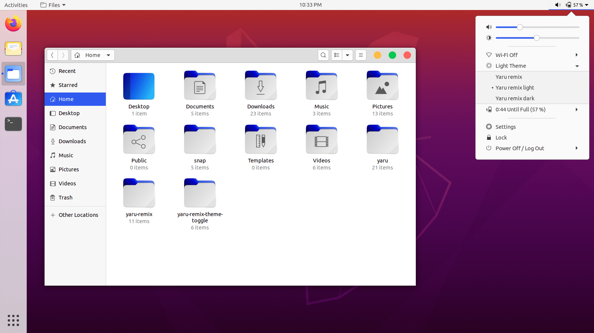
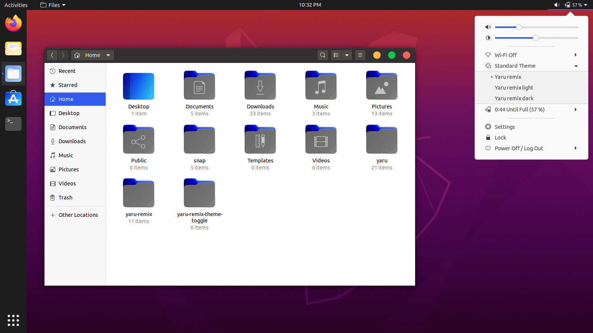
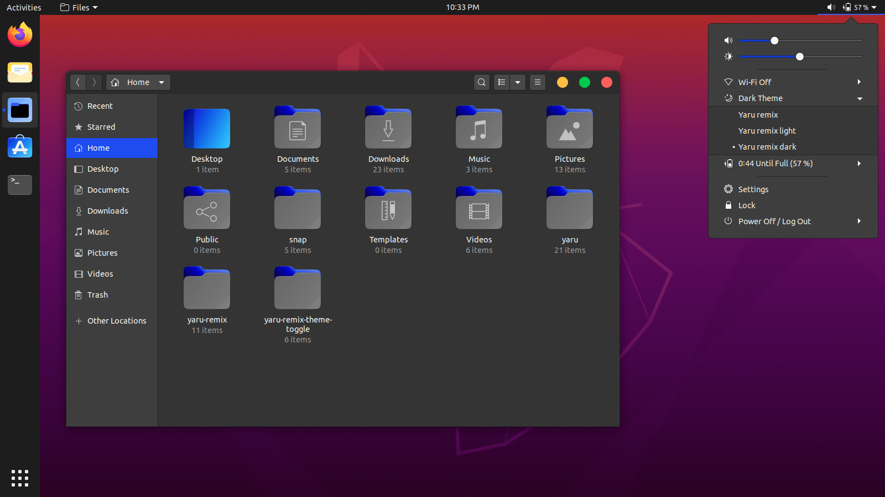

.png)
### Yaru-macOS
Yaru-macOS is a fork of [Yaru](https://github.com/ubuntu/yaru) theme.

Yaru-macOS includes:
- GTK3 theme
- gnome-Shell theme
- Ubuntu-Dock theme (indicators)

### Installation (source):
If you would like to build from master, please follow instructions from [here](source.md).

### Screenshots
**Light:**

**Standard:**

**Dark:**

